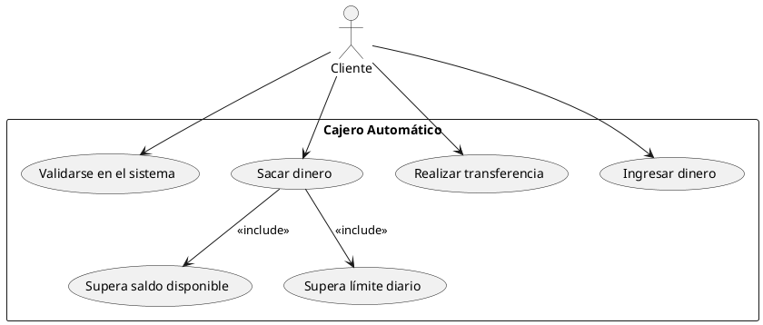

# Diagrama de Casos de Uso: Cajero Automático

## Descripción del Ejercicio

La actividad consiste en modelar el funcionamiento de un cajero automático basado en los siguientes requisitos funcionales:

- **R1.** El cliente debe validarse en el sistema para poder realizar cualquier operación en el cajero automático.
- **R2.** Si el cliente intenta sacar una cantidad que supera el saldo de su cuenta, el cajero le avisará de que no es posible sacar esa cantidad.
- **R3.** Si el cliente intenta sacar una cantidad que supera el límite diario, el cajero le avisará de que no es posible y volverá a solicitar una cantidad.
- **R4.** El cliente podrá hacer una transferencia a otra cuenta.
- **R5.** El cliente podrá realizar un ingreso a través del cajero automático.

El objetivo es representar estos requisitos mediante un diagrama de casos de uso utilizando PlantUML, describir los escenarios y reflexionar sobre la utilidad de los diagramas de casos de uso.

---

## Diagrama de Casos de Uso

A continuación se muestra el diagrama de casos de uso que modela los requisitos funcionales del cajero automático:

# Descripción del Caso de Uso: "Sacar Dinero"

## Interacciones entre el Actor y el Caso de Uso

### Precondiciones:

- El cliente debe estar validado en el sistema (R1).

### Flujo Principal:

1. El cliente selecciona la opción "Sacar dinero".
2. El cajero solicita la cantidad a retirar.
3. El cliente ingresa la cantidad deseada.
4. El cajero verifica si la cantidad supera el saldo disponible (R2) o el límite diario (R3).
5. Si no se superan los límites, el cajero dispensa el dinero y actualiza el saldo de la cuenta.
6. El cajero imprime un comprobante y finaliza la operación.

### Flujos Alternativos:

- **Si se supera el saldo disponible (R2):**
  - El cajero muestra un mensaje de error indicando que no hay suficiente saldo.
  - El cajero solicita una nueva cantidad o cancela la operación.

- **Si se supera el límite diario (R3):**
  - El cajero muestra un mensaje de error indicando que se ha superado el límite diario.
  - El cajero solicita una nueva cantidad o cancela la operación.

---

# Reflexión sobre los Diagramas de Casos de Uso

## ¿Para qué sirve realizar un diagrama de casos de uso?

Un diagrama de casos de uso es una herramienta visual que permite modelar la interacción entre los actores (usuarios o sistemas externos) y el sistema que se está diseñando. Su utilidad radica en:

### Claridad y Comunicación:

- Facilita la comprensión de los requisitos funcionales del sistema.
- Sirve como punto de partida para la comunicación entre analistas, desarrolladores y stakeholders.

### Identificación de Requisitos:

- Ayuda a identificar y organizar los requisitos funcionales del sistema.
- Permite detectar posibles omisiones o inconsistencias en los requisitos.

### Diseño del Sistema:

- Proporciona una base para el diseño de la arquitectura del sistema.
- Define los escenarios principales y alternativos que el sistema debe manejar.

### Documentación:

- Sirve como documentación técnica para futuras fases de desarrollo y mantenimiento.

## ¿Qué aporta?

- Una visión clara y estructurada de las funcionalidades del sistema.
- Una guía para la implementación de los casos de uso en el código.
- Una herramienta para validar los requisitos con los stakeholders antes de comenzar el desarrollo.

---

# Recursos Utilizados

- Apuntes de clase.
- [PlantUML](https://plantuml.com/es/): Herramienta para crear diagramas UML.
- [PlantUML Online](https://www.plantuml.com/plantuml/uml/): Editor en línea para generar diagramas UML.
